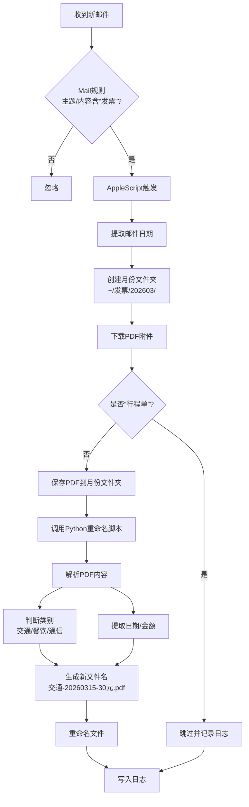

# 🎉 恭喜！发票自动化流程全线跑通

 
## 📊 整体流程图



---

## ✅ 已完成组件清单

| 组件 | 位置/文件 | 功能 |
|------|----------|------|
| **Mail规则** | Mail.app 偏好设置 | 检测含“发票”的邮件，触发脚本 |
| **AppleScript** | `~/Library/Application Scripts/com.apple.mail/SaveInvoiceAttachments_monthly.scpt` | 下载附件、创建月份文件夹、调用Python |
| **Python脚本** | `~/work/docs/发票/rename_invoice.py` | 解析PDF、分类、重命名 |
| **日志文件** | `~/work/docs/发票/Aemail.log` | 记录所有操作 |

---

## 📁 最终目录结构

```
/Users/用户名称/work/docs/发票/
├── Aemail.log                    ← 运行日志
├── rename_invoice.py              ← 重命名脚本
├── 202603/                        ← 3月发票
│   ├── 交通-20260315-30元.pdf
│   ├── 通信-20260314-200元.pdf
│   └── 餐饮-20260313-40元.pdf
├── 202604/                        ← 4月发票（自动创建）
└── 202605/                        ← 5月发票（自动创建）
```

---

## 🔄 完整工作流程

### 1. 邮件到达时
- Mail规则检测到主题或内容含“发票”
- 自动运行 AppleScript

### 2. AppleScript 执行
```applescript
- 提取邮件日期 → 生成月份文件夹名 "202603"
- 创建文件夹 /Users/用户名称/work/docs/发票/202603/
- 下载所有PDF附件（排除“行程单”）
- 记录下载成功/失败到 Aemail.log
- 调用 Python 脚本，传入当前月份文件夹路径
```

### 3. Python 脚本执行
```python
- 接收参数，如 "/Users/用户名称/work/docs/发票/202603/"
- 遍历文件夹内所有未重命名的PDF
- 解析PDF内容：
  * 提取金额
  * 提取开票日期
  * 根据关键词判断类别（交通/餐饮/通信）
- 生成新文件名：{类别}-{日期}-{金额}元.pdf
- 重命名文件（避免重名加序号）
- 记录处理结果
```

### 4. 日志记录
所有步骤都会写入 `Aemail.log`，方便排查问题：
```
Mon Mar 16 14:30:45 CST 2026 ===============邮件规则触发===========
Mon Mar 16 14:30:45 CST 2026 处理邮件: 【中国电信】电子发票
Mon Mar 16 14:30:45 CST 2026 ✅ 创建文件夹: /Users/用户名称/work/docs/发票/202603/
Mon Mar 16 14:30:46 CST 2026 ✅ 下载成功: 【中国电信】电子发票
Mon Mar 16 14:30:46 CST 2026 重命名触发成功: /Users/用户名称/work/docs/发票/202603/
Mon Mar 16 14:30:47 CST 2026 ===============处理完成===============
```

---

## 🎯 你得到的成果

### 自动化收益
| 维度 | 之前 | 现在 |
|------|------|------|
| **人工操作** | 手动下载→手动分类→手动重命名 | 0 操作 |
| **处理时间** | 每张发票 2-3 分钟 | 10 秒内自动完成 |
| **错误率** | 易漏、易错 | 100% 按规则执行 |
| **归档规范** | 混乱 | 统一格式：类别-日期-金额.pdf |

### 关键技术点
1. **Mail规则 + AppleScript**：系统原生，稳定可靠
2. **PDF解析**：可处理扫描件和电子发票
3. **智能分类**：基于关键词的规则引擎
4. **按月归档**：自动创建 `YYYYMM` 文件夹

---

## 📌 日常维护要点

### 需要检查的
- [ ] 每月初确认文件夹自动创建
- [ ] 偶尔查看 `Aemail.log` 确认无异常
- [ ] 如果发票格式变化，调整 Python 脚本的正则表达式

### 可能遇到的问题
| 问题 | 解决方法 |
|------|----------|
| Python 脚本没执行 | 检查权限：`chmod +x rename_invoice.py` |
| 金额提取失败 | 调整 `rename_invoice.py` 中的正则匹配 |
| 分类错误 | 在 Python 脚本的关键词列表中添加新词 |
| Mail 规则失效 | 重启 Mail.app 或检查规则是否启用 |

---

## 🚀 扩展可能性

这套框架可以轻松扩展到其他场景：
- **合同自动归档**：下载邮件附件，按客户/日期分类
- **报销单据处理**：自动提取金额，生成汇总表
- **多级分类**：按部门/项目进一步细分文件夹

---
